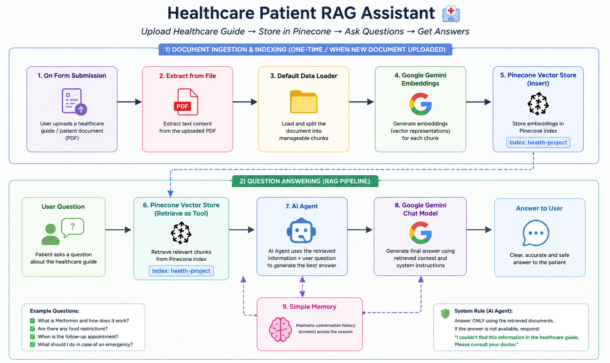

# 🏥 Healthcare Patient RAG Assistant

An AI-powered healthcare assistant that uses **Retrieval-Augmented Generation (RAG)** to answer patient questions using information retrieved from a healthcare guide.

The workflow combines **n8n, Google Gemini, Pinecone, AI Agents, and PDF document processing** to create a knowledge-grounded healthcare Q&A system.

## 🚀 What This Workflow Does

This workflow allows a healthcare guide or patient document to be uploaded as a PDF and converted into a searchable knowledge base.

The document is processed, transformed into vector embeddings, and stored in **Pinecone**. When a user asks a question, the AI Agent retrieves the most relevant information from the knowledge base and generates a response based only on the retrieved content.

The workflow is designed to avoid unsupported answers and directs users to consult a doctor when the requested information is not available in the healthcare guide.

## ⚙️ Workflow

### Document Ingestion & Indexing

1. **Upload Healthcare Document**
   - A healthcare guide or patient document is uploaded through an n8n form.

2. **Extract PDF Content**
   - The PDF content is extracted for further processing.

3. **Document Processing**
   - The extracted content is loaded and prepared for vector-based retrieval.

4. **Generate Embeddings**
   - Google Gemini Embeddings convert the document content into vector representations.

5. **Store in Pinecone**
   - The generated embeddings are stored in a Pinecone Vector Database.

### Question Answering

6. **User Question**
   - The user submits a healthcare-related question through the chat interface.

7. **Retrieve Relevant Information**
   - The AI Agent uses Pinecone as a retrieval tool to find relevant information from the healthcare knowledge base.

8. **AI Agent Processing**
   - The AI Agent combines the user's question with the retrieved information.

9. **Generate Response**
   - Google Gemini generates a clear response based on the retrieved healthcare information.

10. **Conversation Memory**
    - Simple Memory maintains conversation context during the session.

## 📄 Knowledge Base Document

The workflow uses a healthcare patient guide as the source document for the RAG pipeline.

The document is processed, converted into vector embeddings, and stored in Pinecone so the AI Agent can retrieve relevant information when answering patient questions.

👉 [View / Download Healthcare Patient Guide](sample-data/Healthcare_Patient_Guide.pdf)

## 🎯 Key Features

- 📄 PDF healthcare document processing
- 🔎 Retrieval-Augmented Generation (RAG)
- 🧠 AI-powered document Q&A
- 🗄️ Pinecone Vector Database
- ✨ Google Gemini AI
- 🤖 AI Agent
- 💬 Interactive chat interface
- 🧠 Conversation memory
- 🛡️ Knowledge-grounded responses
- 🚫 Prevents unsupported information from being generated
- 👨‍⚕️ Doctor consultation fallback when information is unavailable

## 💡 Example Questions

The assistant can handle questions such as:

- When should I take Metformin?
- What foods should I avoid?
- When is my follow-up appointment?
- What should I do in an emergency?

The AI retrieves relevant information from the healthcare guide before generating a response.

## 🧰 Tech Stack

- **n8n** – Workflow Automation
- **Google Gemini** – AI Chat Model
- **Gemini Embeddings** – Vector Embeddings
- **Pinecone** – Vector Database
- **AI Agent** – Query Processing & Response Generation
- **Simple Memory** – Conversation Context
- **PDF Processing** – Healthcare Document Extraction
- **RAG** – Knowledge Retrieval

## 🛠️ Skills Demonstrated

- AI Workflow Automation
- Retrieval-Augmented Generation (RAG)
- AI Agent Development
- Vector Database Integration
- Document Processing
- Prompt Engineering
- Knowledge-Grounded AI
- Google Gemini Integration
- Pinecone Integration
- n8n Workflow Design
- AI-powered Document Q&A
- API & AI Tool Integration

## 🚀 Project Implementation

This project demonstrates how healthcare documents can be transformed into a searchable AI knowledge base using **RAG, vector embeddings, and AI Agents**, enabling users to ask questions and receive document-grounded responses.

A sanitized n8n workflow file is included for portfolio demonstration.

👉 [View / Download Workflow JSON](Health_Care_Patient_RAG.json)

For custom implementation or commercial use, please <strong>Contact Us:</strong>
  

## 👨‍💻 Author

**Faheem Abbas**

AI Automation Specialist | n8n Expert | AI Agents | AI-Powered Business Automation | Lead Generation | API Integrations | WhatsApp Automation

**#n8n #AIAutomation #GoogleGemini #LeadGeneration #LeadQualification #WorkflowAutomation #Automation #ArtificialIntelligence #bluemoonways**
